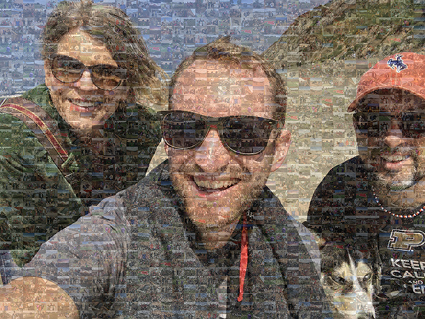
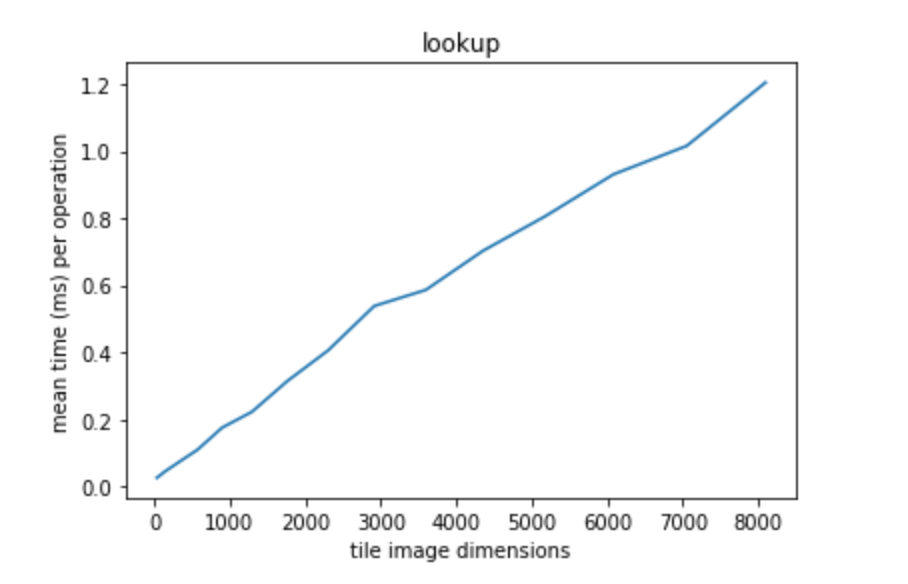
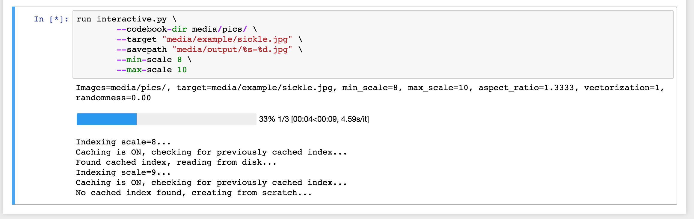
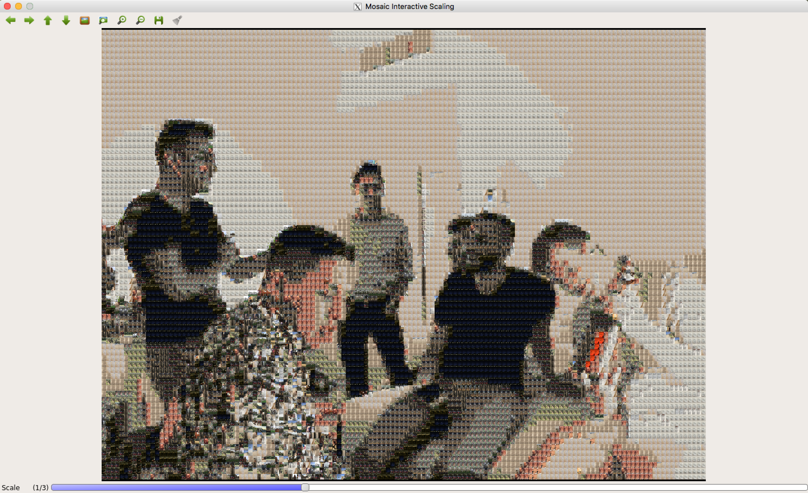
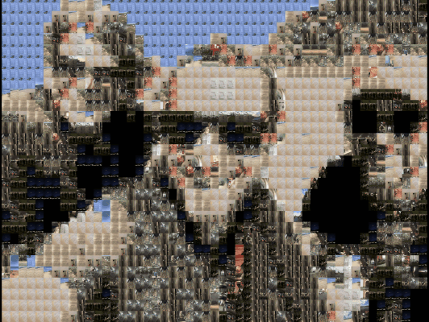
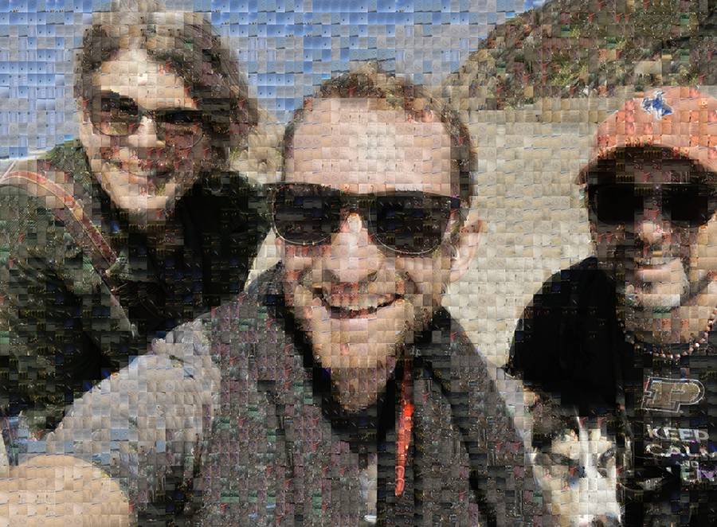

# photomosaic

Creating photomosaic images & videos. 

<p align="center">
    
</p>

If you're looking to print a poster, you can use more advanced settings like `--best-k` to choose instead from the closest k-neighbors, `--opacity` to make use of the original photo, and `--randomness` to include random photos from your collection:

<p align="center">
    
</p>

Because I tend to get carried away with things, this library can also (unrelated to photomosaics, but related to doing cool things with your photo collection) make facial montages aligned on a particular person's face:

<p align="center">
    
</p>

This makes use of an embedding network, a simple linear classifer on top, and a warp matrix for each image to align the eyes and scale it appropriately. 

## How does it work?

We're doing the digital equivilent of a very old technique - creating mosaics:

<p align="center">
   
</p>

except instead of using physical tiles, you can use your photo collection, emojis, or any set of digital images you'd like.

Take a target image, say, a family photo. You can recreate that target image as a mosaic using a "codebook" of other images as tiles. If you intelligently search through and pick the best "codebook" image in your tileset, you can create arbitrarily good recreations of your target image. 

This project cuts up the target image into tiles (you control the tile size with `scale` parameter), and for each tile patch, uses the L2 similarity metric (with an ultrafast lookup using Facebook's [faiss](https://github.com/facebookresearch/faiss) library) to find the closest codebook tile image to replace it with.

Since this lookup is quite fast

<p align="center">
   
</p>

you can even do this for each frame in a video and create videomosaics (see `video.py`). You can also run a battery of fun performance metrics with `performance.py` if you're really curious. 

## Setup

Ensure you have installed:

* `Docker`
* `XQuartz` (version 2.7.5 or higher) if you'd like to run the `interactive.py` OpenCV GUI explorer. Otherwise you don't need it.

For `XQuartz`, [turn on the Remote setting](https://blogs.oracle.com/oraclewebcentersuite/running-gui-applications-on-native-docker-containers-for-mac), and quit and restart `XQuartz` (!).

I've only tested this on my Mac OS X, but since it's Dockerized it should run anywhere Docker does!

Next, build the Docker images and run a container:

```bash
# build the Docker image (may take a while!)
sh build.sh

# launch an Docker container running an iPython notebook server
sh launch.sh

# then go to http://localhost:8888/
# there you'll be able to run scripts and view GUI 
```

If you'd like to SSH into the Docker container itself, after running the above:

```bash
sh enter.sh
```

Finally, and most importantly, get together some photos and videos you'd like to either create images from (use as mosaic tiles) or create mosaics of (turn your photos/videos into mosaics). I took my iPhone photos/videos for the last few years and threw them all in a folder, and you can see some of the cool results below.

## Photomosaic Scripts

Note that the default setting for all of these scripts are to use caching, which means once you've indexed a particular folder of photos at a certain scale (read: tile size), you'll never need to do it again. 

<p align="center">
    
</p>

If you add or delete even a single file from the folder, photomosaic is smart enough to know to reindex. Cached index pickle files are stored by default in the `cache` folder.

### 1) Creating mosaics from an image

Reconstruct an image using a set of other images, downsized and used as tiles. 

<p align="center">
    
</p>

```bash
$ python mosaic.py \
    --target "media/example/beach.jpg" \
    --savepath "media/output/%s-mosaic-scale-%d.jpg" \
    --codebook-dir "your/codebook/tiles/directory/" \
    --scale 8 \
    --height-aspect 4 \
    --width-aspect 3 \
    --vectorization-factor 1
```

Arguments:

* `--savepath`: where to save it. %s is the original filename and %d will be the scale
* `--target`: the image we're trying to reconstruct from other tile images
* `--codebook-dir`: the images we'll create tiles out of (codebook)
* `--scale`: how large/small to make the tiles. Multipler on the aspect ratio.
* `--height-aspect`: height aspect
* `--width-aspect`: width aspect
* `--vectorization-factor`: if we downsize the feature vector before querying (generally don't need to adjust this)


### 2) Creating mosaic videos

Do the same, but with every frame of a video!

Example (Tipper concert):

<p align="center">
    
</p>

```bash
$ python video.py \
    --target "path/to/your/video.mov" \
    --savepath "media/output/%s-at-scale-%d.mp4" \
    --codebook-dir "your/codebook/tiles/directory/" \
    --scale 10 \
    --height-aspect 4 \
    --width-aspect 3
```

Only use `*.mp4` for the savepath output, that's all I support for now.

Arguments:

* `--target`: the video we're trying to reconstruct from other tile images
* `--codebook-dir`: the images we'll create tiles out of (codebook)
* `--scale`: how large/small to make the tiles. Multipler on the aspect ratio.
* `--height-aspect`: height aspect
* `--width-aspect`: width aspect
* `--savepath`: save our video as output to here (only tested on .mp4 extensions)

`ffmpeg` is used for the audio splicing, since OpenCV can't really handle that. 

You can adjust aspect ratio here too, but those and more are optional arguments.  

### 3) Exploring mosaic scales interactively

Not sure which scale will look best? Want to play around with some different settings? Run this. 

Then just press the `s` key and you'll save the selected scale to disk!

Alternatively, press `ESC` to exit the window without saving. 

<p align="center">
    
</p>

```bash
$ python interactive.py \
    --target "path/to/your/pic.jpg" \
    --savepath "media/output/interactive-%s-at-scale-%d.jpg" \
    --codebook-dir "your/codebook/directory/" \
    --min-scale 1 \
    --max-scale 12
```

Arguments:

* `--target`: the image we're trying to reconstruct from other tile images
* `--codebook-dir`: the images we'll create tiles out of (codebook)
* `--min-scale`: start at this scale value (int)
* `--max-scale`: let user increase scale up to this value (int)
* `--savepath`: where to save it. %s is the original filename and %d will be the scale

You can adjust aspect ratio here too, but those and more are optional arguments. 

### 4) Create a GIF from a series of mosaics at varying tile scales

This will create a series of mosaics for a range of scales and then combined them together as a GIF with a specified frames per second. You can adjust the order with `--ascending`. 

<p align="center">
    
</p>

```bash
$ python make_gif.py \
    --target "path/to/pic.jpg" \
    --savepath "media/output/%s-from-%d-to-%d.gif" \
    --codebook-dir "your/codebook/directory/" \
    --min-scale 5 \
    --max-scale 25 \
    --fps 3 \
    --ascending 0
```

If you pick a large range of scales, expect to wait a half and hour or so, depending on your machine. 

Note that the first time you run this on a container you might see a `Imageio: 'ffmpeg-linux64-v3.3.1' was not found on your computer; downloading it now.` message, that's normal.

#### Optimizing GIF file size

If you simply run the above, you might get a 200 MB GIF file, which is absurd. The easiest way to remedy this is with a tool like `gifsicle`.

Here's what I'd suggest:

```bash
$ brew install gifsicle
$ gifsicle -O3 --resize-height 400 --colors 256 < your/gigantic.gif  > totally/reasonable/sized.gif
```

For example, I reduced a 130 MB GIF to 2 MB one using that command. [EZgif](https://ezgif.com) is a surprisingly good online tool for compressing GIFs with different tradeoffs, but they only support GIFs up to 100 MB in size. 

## Other settings

Here are a few other settings that allow you to tweak the visual output. 

### 1) Randomness (`--randomness`)

If you'd like to bring a little chaos into your photomosaics, use the randomness parameter. 

It's a float in the range `[0, 1)` that is the probability a given tile will be filled in, not with the closest tile in the codebook, but rather a completely random one. 

Example (at 0.05):

<p align="center">
    
</p>

### 2) Stabilization for Videomosaics (`--stabilization-threshold`)

Videomosaics are just a repeated application per frame of the photomosaic functionality. Therefore, tiny changes from frame to frame might cause the same object in the video to be represented with different tiles. This isn't terrible but it gives us less visual stability because it's always changing. 

`--stabilization-threshold` is a float which represents a fraction of the previous distance for that tile. We only replace the tile in that slot if:

    `current closest tile's distance` < `--stabilization-threshold` * `last frame's distance`

Otherwise, we simply keep the tile the same for that frame. This is a crude stabilitiy heuristic, and in the future I could certainly do something smarter. 

### 3) Opacity (`--opacity`)

Some photomosaics "cheat" a bit and just layer on a watered down version of the original image in a specified ratio along with the mosaic tiles. This is a popular enough technique I decided to include it. Simply use the `--opacity` flag:

<p align="center">
    
</p>

```bash
$ python mosaic.py \
    --target "media/example/beach.jpg" \
    --savepath "media/output/%s-mosaic-scale-%d.jpg" \
    --codebook-dir media/pics/ \
    --scale 13 \
    --height-aspect 4 \
    --width-aspect 3 \
    --opacity 0.4
```

### 4) Best-K (`--best-k`)

You might notice that many of your photomosaics will have large regions of similar color and so a single image gets tiled over large portions of your image. If you'd like to throw in a little (sensible) randomness, instead of using the (`--randomness`) sludgehammer, you can use the `--best-k`. 

At each tile, with `--best-k`, `k` top matches will be chosen from randomly, weighted roughly inversely by distance (so "closer" images are more likely). 

Here's the same image as above, but with `--best-k 5`:

<p align="center">
    
</p>

```bash
$ python mosaic.py \
    --target "media/example/beach.jpg" \
    --savepath "media/output/%s-mosaic-scale-%d.jpg" \
    --codebook-dir media/pics/ \
    --scale 13 \
    --height-aspect 4 \
    --width-aspect 3 \
    --opacity 0.4 \
    --best-k 5
```

### Face Montages

I really wanted to make face montages, so even though they don't have anything to do with photomosiacs, here they are! 

Basically this means a GIF of a single person from different photos but all aligned on that person's face.

The way it works:

1. Put together a folder of photos (`--target-face-dir`) with ONLY the face you want in the montage (yourself, for example). Selfies are great for this. 
1. Put together a folder of photos with ANYONE ELSE's face in them (`--other-face-dir`). The more the better. Just don't have your face in them. If you're really short on them / have a lot of group photos, crop yourself out. 
1. Put together a directory of photos you'd like to draw from to make the montage (`--photos-dir`). 

I have included an academic dataset (the [Caltech Faces Dataset](http://www.vision.caltech.edu/html-files/archive.html)) of 450 faces in the `media/faces/other_faces` (that are unlikely to be you) as a starting point. If you make use of this for some academic reason, please do cite both them and `dlib`. 

If you want good accuracy, I'd try to add at least 100 photos to both the `--target-face-dir` and the `--other-face-dir`. I added about that and as a result the `face_montage.py` script had about 1 false positive per 300 photos (easily removed before running the `create_gif_from_photos_folder.py` step).

Here's [a place to find many, many more pictures with random faces](https://www.kairos.com/blog/60-facial-recognition-databases). 

Anyway, enough description. To run the facial embeddings, train the linear classifier, and align the faces:

```bash
$ python face_montage.py \
        --target-face-dir media/faces/will \
        --other-face-dir media/faces/other_faces \
        --photos-dir media/pics \
        --output-size 800 \
        --savedir media/output/montage_will/ \
        --sort-by-photo-age
```

then to actually compile them into a GIF, use the `--savedir` from above and then run:


```bash
$ python create_gif_from_photos_folder.py \
        --photos-dir media/output/montage_will/ \
        --fps 7 \
        --fuzz 3 \
        --order ascending
```

It's nice to separate these two steps since you might want to remove false positives from the folder created in the first step, remove unflattering pics, or mess around with how many frames per second you'd like in the resulting GIF. I implemented caching on the embedding, but running over a full set of photos (4,000+ for just the segment of my photos library I had the patience to run over) still can take some time.

### Using `ffprobe` / `ffmpeg`

A few of the routines in this project make use of parameters from the video/audio files. I often call the command line utilities directly by spinning up a separate process, which is a little icky, but gets the job done.

FFProbe is an excellent tool for this, and the command line interface is quite powerful. I recommend [this guide](https://trac.ffmpeg.org/wiki/FFprobeTips) for getting the handle on it. 

Similarly, `ffmpeg` makes splicing audio/video streams and recombining them easy. A few good resources for `ffmpeg` specifically:

* [`ffmpeg` encoding course](http://slhck.info/ffmpeg-encoding-course/#/9)
* [`ffmpeg` tutorial](https://github.com/leandromoreira/ffmpeg-libav-tutorial#chapter-0---the-infamous-hello-world)
* [Digital video introduction](https://github.com/leandromoreira/digital_video_introduction)

### ImageMagick

The `convert` tool is also nice for making GIFs:

```
$ cd your/cool/folder/with/jpg/images
$ convert -delay 5 -layers optimize *.jpg output.gif
```

then you may want to apply the gifsicle trick for compressing/resizing that GIF to make it be a reasonable size. 

### Unit tests

There is a small (but embarassingly incomplete) test suite that you can run with:

```bash
sh test.sh
```

Not much coverage at the moment. 
