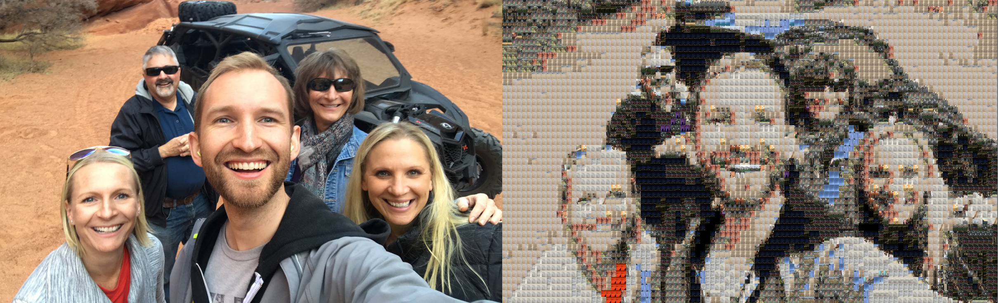
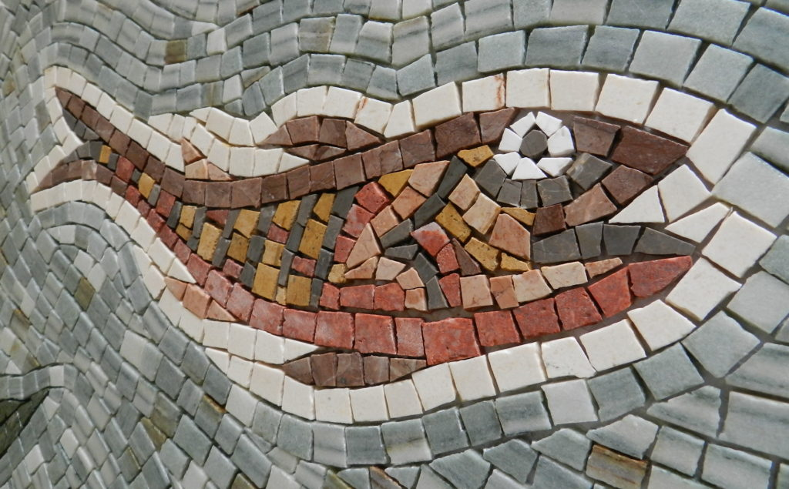
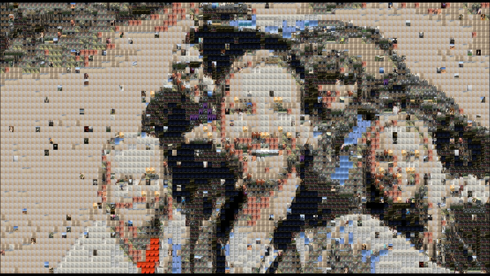

# photomosiac

Creating photomosiac images & videos. 

<p align="center">
    
</p>

## What does that mean?

We're doing the digital equivilent of a very old technique - creating mosaics:

<p align="center">
   
</p>

except instead of using physical tiles, you can use your photo collection, emojis, or any set of digital images you'd like.

Take a target image, say, a family photo. You can recreate that target image as a mosaic using a "codebook" of other images as tiles. If you intelligently search through and pick the best "codebook" image in your tileset, you can create arbitrarily good recreations of your target image. 

This project cuts up the target image into tiles (you control the tile size with `scale` parameter), and for each tile patch, uses the L2 similarity metric (with an ultrafast lookup using Facebook's [faiss](https://github.com/facebookresearch/faiss) library) to find the closest codebook tile image to replace it with.

You can even do this for each frame in a video and create videomosaics (see `video.py`). 

## Setup

Ensure you have installed:

* `Docker`
* `XQuartz` (version 2.7.5 or higher) if you'd like to run the `interactive.py` OpenCV GUI explorer. Otherwise you don't need it.

For `XQuartz`, [turn on the Remote setting](https://blogs.oracle.com/oraclewebcentersuite/running-gui-applications-on-native-docker-containers-for-mac), and quit and restart `XQuartz` (!).

I've only tested this on my Mac OS X, but since it's Dockerized it should run anywhere Docker does!

Next, build the Docker images and run a container:

```bash
# build the Docker image (may take a while!)
sh build.sh

# launch an Docker container running an iPython notebook server
sh launch.sh

# then go to http://localhost:8888/
# there you'll be able to run scripts and view GUI 
```

If you'd like to SSH into the Docker container itself, after running the above:

```bash
sh enter.sh
```

Finally, and most importantly, get together some photos and videos you'd like to either create images from (use as mosaic tiles) or create mosaics of (turn your photos/videos into mosaics). I took my iPhone photos/videos for the last few years and threw them all in a folder, and you can see some of the cool results below.

## Photomosiac Scripts

Note that the default setting for all of these scripts are to use caching, which means once you've indexed a particular folder of photos at a certain scale (read: tile size), you'll never need to do it again. 

If you add or delete even a single file from the folder, photomosaic is smart enough to know to reindex. Cached index pickle files are stored by default in the `cache` folder.

### 1) Creating mosaics from an image

Reconstruct an image using a set of other images, downsized and used as tiles. 

```bash
$ python mosaic.py \
    --target "media/example/beach.jpg" \
    --savepath "media/output/%s-mosiac-scale-%d.jpg" \
    --codebook-dir media/pics/ \
    --scale 8 \
    --height-aspect 4 \
    --width-aspect 3 \
    --vectorization-factor 1
```

Arguments:

* `--target`: the image we're trying to reconstruct from other tile images
* `--codebook-dir`: the images we'll create tiles out of (codebook)
* `--scale`: how large/small to make the tiles. Multipler on the aspect ratio.
* `--height-aspect`: height aspect
* `--width-aspect`: width aspect
* `--vectorization-factor`: if we downsize the feature vector before querying (generally don't need to adjust this)

Example:

<p align="center">
    
</p>


### 2) Creating mosaic videos

Do the same, but with every frame of a video!

```bash
$ python video.py \
    --target "media/example/cabo_sailing.mov" \
    --savepath "media/output/%s-at-scale-%d.mp4" \
    --codebook-dir "media/pics/" \
    --scale 10 \
    --height-aspect 4 \
    --width-aspect 3
```

Arguments:

* `--target`: the video we're trying to reconstruct from other tile images
* `--codebook-dir`: the images we'll create tiles out of (codebook)
* `--scale`: how large/small to make the tiles. Multipler on the aspect ratio.
* `--height-aspect`: height aspect
* `--width-aspect`: width aspect
* `--savepath`: save our video as output to here (only tested on .mp4 extensions)

`ffmpeg` is used for the audio splicing, since OpenCV can't really handle that. 

You can adjust aspect ratio here too, but those and more are optional arguments.  

Example:

<p align="center">
    
</p>

### 3) Exploring mosaic scales

Not sure which scale will look best? Want to play around with some different settings? Run this. 

Then just press the `s` key and you'll save the selected scale to disk!

Alternatively, press `ESC` to exit the window without saving. 

```bash
$ python interactive.py \
    --target "media/example/arizona.jpg" \
    --savepath "media/output/interactive-%s-at-scale-%d.jpg" \
    --codebook-dir "media/pics/" \
    --min-scale 1 \
    --max-scale 12
```

Arguments:

* `--target`: the image we're trying to reconstruct from other tile images
* `--codebook-dir`: the images we'll create tiles out of (codebook)
* `--min-scale`: start at this scale value (int)
* `--max-scale`: let user increase scale up to this value (int)

You can adjust aspect ratio here too, but those and more are optional arguments. 

Example:

<p align="center">
    
</p>

### 4) Create a GIF from a series of mosaics at varying tile scales

This will create a series of mosaics for a range of scales and then combined them together as a GIF with a specified frames per second. You can adjust the order with `--ascending`. 

```bash
$ python make_gif.py \
    --target "media/pics/2018-04-01 12.00.27.jpg" \
    --savepath "media/output/%s-from-%d-to-%d.gif" \
    --codebook-dir "media/pics/" \
    --min-scale 5 \
    --max-scale 25 \
    --fps 3 \
    --ascending 0
```

Note that the first time you run this on a container you might see a `Imageio: 'ffmpeg-linux64-v3.3.1' was not found on your computer; downloading it now.` message, that's normal.

Example:

<p align="center">
    
</p>

### Other settings

Here are a few other settings that allow you to tweak the visual output. 

#### Randomness (`--randomness`)

If you'd like to bring a little chaos into your photomosiacs, use the randomness parameter. 

It's a float in the range `[0, 1)` that is the probability a given tile will be filled in, not with the closest tile in the codebook, but rather a completely random one. 

Example (at 0.05):

<p align="center">
    
</p>

#### Stabilization for Videomosaics (`--stabilization-threshold`)

Videomosaics are just a repeated application per frame of the photomosaic functionality. Therefore, tiny changes from frame to frame might cause the same object in the video to be represented with different tiles. This isn't terrible but it gives us less visual stability because it's always changing. 

`--stabilization-threshold` is a float which represents a fraction of the previous distance for that tile. We only replace the tile in that slot if:

    `current closest tile's distance` < `--stabilization-threshold` * `last frame's distance`

Otherwise, we simply keep the tile the same for that frame. This is a crude stabilitiy heuristic, and in the future I could certainly do something smarter. 

### Using `ffprobe` / `ffmpeg`

A few of the routines in this project make use of parameters from the video/audio files. I often call the command line utilities directly by spinning up a separate process, which is a little icky, but gets the job done.

FFProbe is an excellent tool for this, and the command line interface is quite powerful. I recommend [this guide](https://trac.ffmpeg.org/wiki/FFprobeTips) for getting the handle on it. 

Similarly, `ffmpeg` makes splicing audio/video streams and recombining them easy. A few good resources for `ffmpeg` specifically:

* [`ffmpeg` encoding course](http://slhck.info/ffmpeg-encoding-course/#/9)
* [`ffmpeg` tutorial](https://github.com/leandromoreira/ffmpeg-libav-tutorial#chapter-0---the-infamous-hello-world)
* [Digital video introduction](https://github.com/leandromoreira/digital_video_introduction)

### Emojis

This project first started as a way to make photomosaics from emojis. That didn't turn out to be that aesthetically pleasing, but here's a few notes on it.

#### Downloading Emojis

Run the scraping script. Make sure you have `bs4` and `requests` Python packages installed. 

```bash
$ python scripts/scrape_popular_emojis.py
```

To get the set of all (not just popular) emojis, download the 128 x 128 set from [here](https://emojipedia.org/emojione/3.1/).

### Unit tests

There is a small (but embarassingly incomplete) test suite that you can run with:

```bash
sh test.sh
```

Not much coverage at the moment. 
